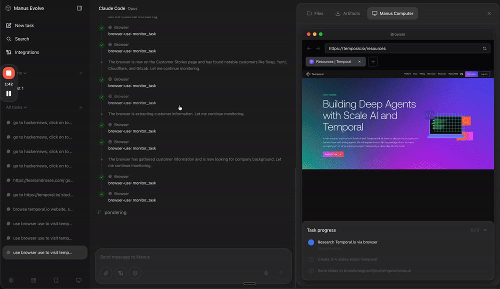

<p align="center">
  
</p>

<p align="center">
  A version of <a href="https://manus.im">Manus</a> powered by the <a href="https://github.com/evolving-machines-lab/evolve"><b>Evolve SDK</b></a>
</p>

<br>

<p align="center">
  
</p>

## Setup

```bash
npm install
cp .env.example .env.local
npm run dev
```

## Environment Variables

| Variable | Required | Description |
|----------|----------|-------------|
| `EVOLVE_API_KEY` | Yes | API key for running agents via Evolve SDK |
| `COMPOSIO_API_KEY` | No | API key for third-party integrations (GitHub, Gmail, Slack, etc.) |
| `DATABASE_PATH` | No | Custom SQLite database path (defaults to `data/manus.db`) |

## Features

- **Agents**: Claude Code, Codex CLI, Gemini CLI, Qwen Code
- **Skills**: PDF, DOCX, PPTX, XLSX, browser automation, and much more
- **Integrations**: GitHub, Gmail, Slack, Notion, and 1000+ via Composio

## Usage

1. Select an agent and model
2. Add skills and integrations as needed
3. Send a prompt - the agent runs in a secure sandbox
4. View streaming output, artifacts, and browser sessions
